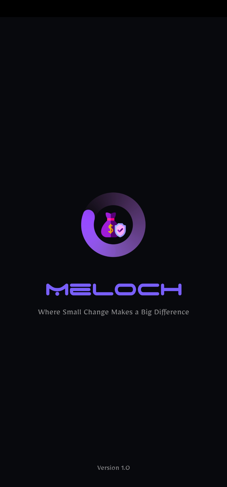
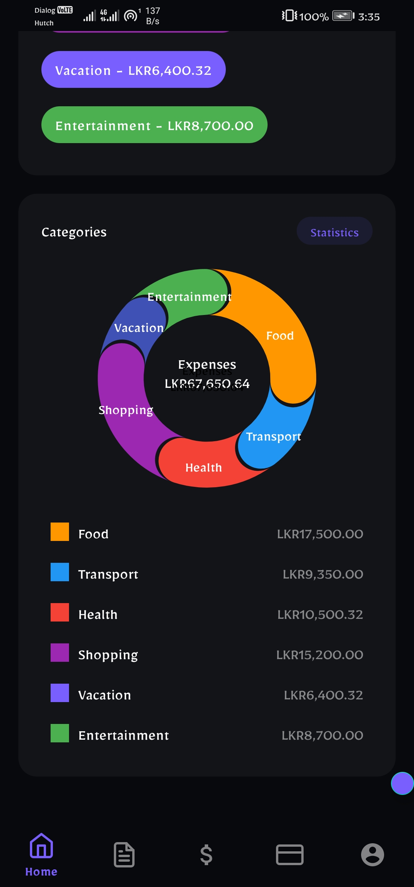
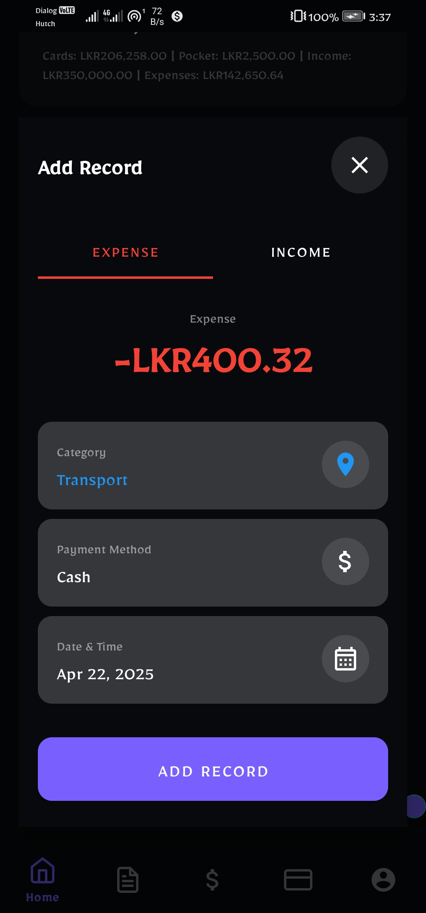
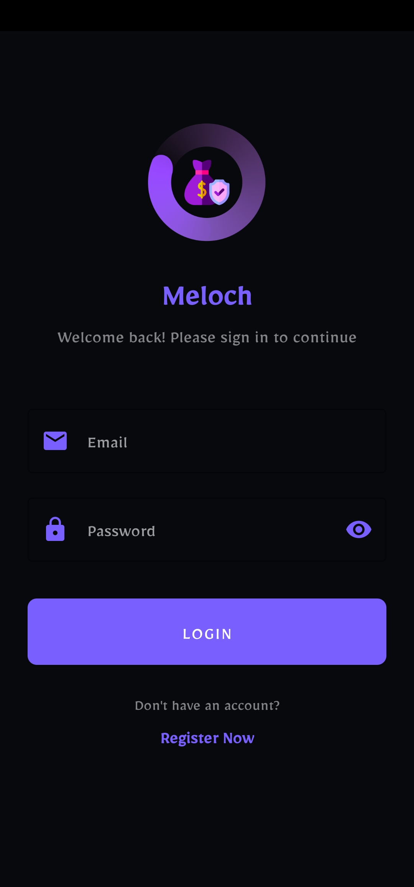
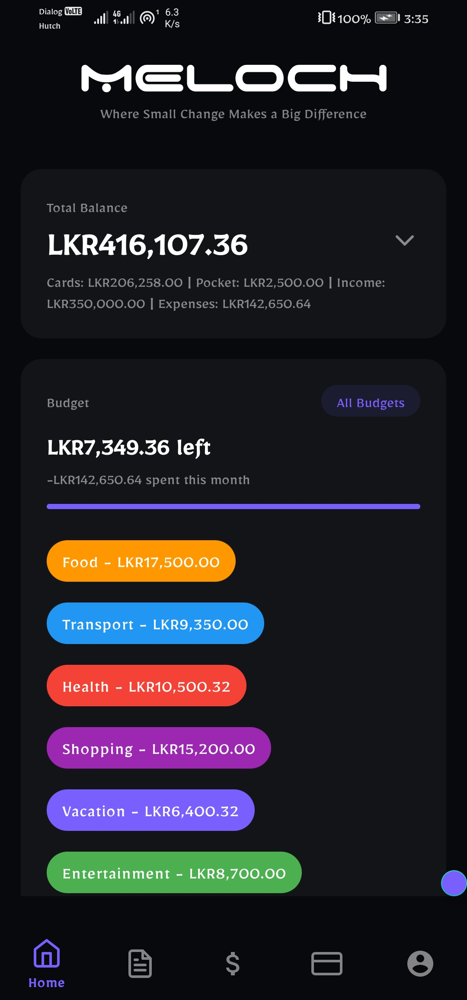
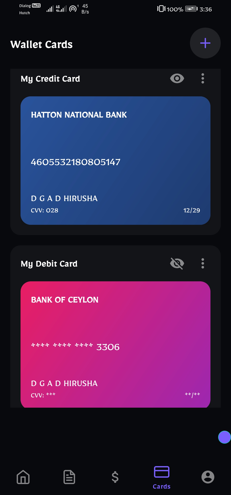
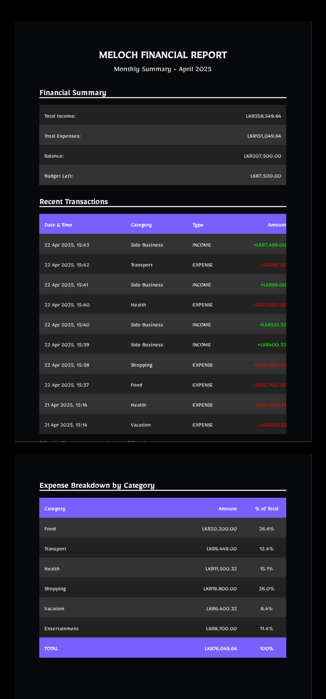

# 📱 Meloch – Personal Finance Tracker 💸

**Meloch** is a modern, intuitive Android application built with Kotlin, designed to help users take full control of their personal finances. With a clean UI, secure per‑user data isolation, and powerful features like budgeting, transaction tracking, wallet card management, and exportable reports, Meloch turns everyday financial management into a seamless experience.

<p align="center">
  
</p>

---

## ✨ Features

### 🧾 **Core Functionalities**
- **User Account Management** – Secure registration/login with email-based data isolation.
- **Transaction Recording** – Add income/expense entries with category, payment method, date, and amount.
- **Budget Planning** – Set monthly budgets per category; track remaining budget with visual progress bars.
- **Wallet Card Management** – Securely store credit/debit card details (masked by default).
- **Dashboard Overview** – Real-time view of total balance, budget status, and category-wise spending.
- **Transaction History** – Chronologically grouped records with filtering by date.
- **Statistics & Charts** – Pie charts and bar graphs for income vs. expense and category breakdowns.

<p align="center">
  
  
  
</p>

### 🚀 **Bonus Features**
- **Data Backup (JSON)** – Export all financial data to a portable JSON file.
- **PDF Report Generation** – Professional monthly summaries with charts and transaction tables.
- **Smart Notifications** – Alert users when budgets run low or are reset.
- **Review & Feedback** – In-app rating system with notification follow-up.

---

## 📸 Screenshots

| Login & Registration | Dashboard & Budgets | Add Record |
|----------------------|---------------------|------------|
|  |  |  |

| Statistics & Charts | Wallet Cards | Financial Report (PDF) |
|---------------------|--------------|------------------------|
|  |  |  |

---

## 🛠️ Technical Implementation

### **Architecture & Components**
- **Language:** Kotlin
- **Storage:** `SharedPreferences` for per‑user persistent data (transactions, budgets, balances)
- **Notifications:** Custom `NotificationHelper` with channels for budget alerts and feedback
- **Data Export:**
  - **PDF Report:** Generated with document APIs, includes charts and tables.
  - **JSON Backup:** Structured JSON output for full data portability.
- **UI:** Modern Material Design with color‑coded charts and intuitive navigation.

### **Key Code Highlights**
- `PreferenceManager.kt` – Handles all user‑specific data operations with email‑scoped keys.
- `NotificationHelper.kt` – Manages budget‑low, budget‑limit, and budget‑reset alerts.
- `JSONBackupGenerator.kt` – Creates comprehensive JSON backups of user data.
- `ProfileNotificationHelper.kt` – Sends feedback confirmation notifications.

---

## 📁 Project Structure
```

  meloch/
  ├── app/src/main/java/com/example/meloch/
  │ ├── data/
  │ │ ├── PreferenceManager.kt
  │ │ ├── NotificationHelper.kt
  │ │ ├── ProfileNotificationHelper.kt
  │ │ └── JSONBackupGenerator.kt
  │ ├── ui/
  │ │ ├── LoginActivity.kt
  │ │ ├── MainActivity.kt
  │ │ ├── AddRecordFragment.kt
  │ │ ├── BudgetsFragment.kt
  │ │ └── StatisticsFragment.kt
  │ └── util/
  │ └── Extensions.kt
  ├── res/
  │ ├── layout/ # XML layouts
  │ ├── values/ # strings.xml, colors.xml
  │ └── drawable/ # Icons & graphics
  └── assets/ # PDF templates

```


---

## 🔧 Setup & Installation **

1. **Clone the repository**
   ```bash
   git clone https://github.com/dyneth02/meloch.git
   ```

2. **Open in Android Studio**
3. **Sync Gradle and install required dependencies**
4. **Run on an emulator or physical device (API 24+)**
5. **Note: The app uses SharedPreferences for local storage. No external database or internet permission is required.**

---

**📊 Data Persistence**

- All user data (transactions, budgets, cards, balance) is stored in SharedPreferences with email‑prefixed keys.
- Each user’s data is completely isolated.
- Backup files (JSON/PDF) are saved to the device’s internal storage and can be shared externally.

---

**📬 Notifications**

Meloch uses two notification channels:

  - Budget Alerts – Low budget warnings and reset confirmations.
  - Profile Notifications – Feedback submission acknowledgments.

---

**📄 License**

This project is developed for educational and portfolio purposes. Feel free to explore, modify, and extend the code.

---

**👤 Author**

*D G A D Hirusha – IT23183018*
*Year 02, Semester 02 – Mobile Application Development Lab Exam 03 Submission*
